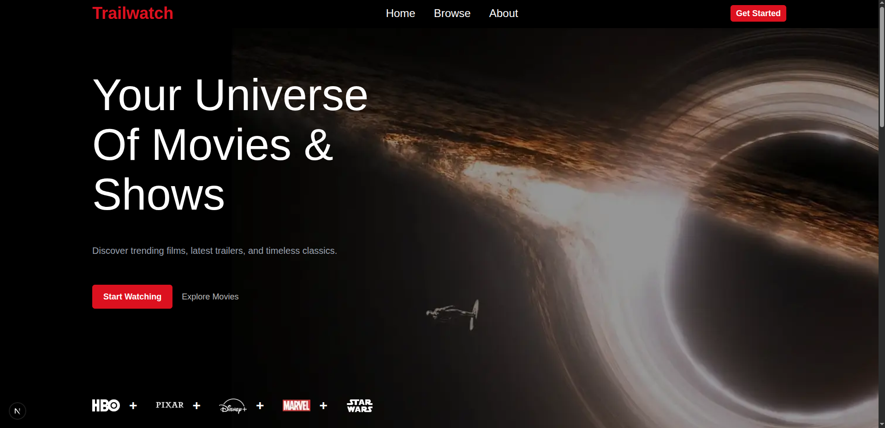
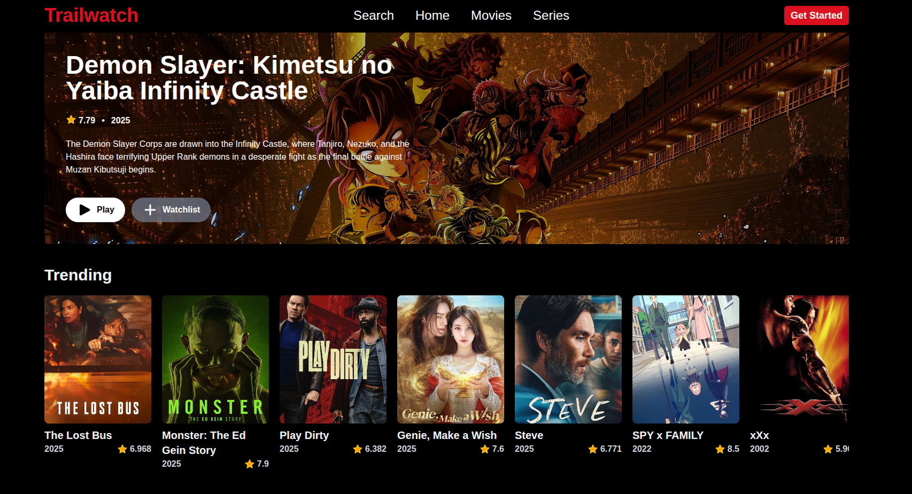

# Trailwatch

Trailwatch is a modern, cinematic web app for discovering trending movies, TV series, and trailers. Built with Next.js, React, and Tailwind CSS, it delivers a fast, intuitive experience with personalized recommendations, ratings, and more.

## Features

- 🎬 **Trending & Popular**: Browse the latest movies and TV series.
- 🔍 **Search**: Instantly find any movie or show with ratings, cast, and trailers.
- ⭐ **Recommendations**: Get personalized suggestions tailored to your taste.
- 🚀 **Fast & Responsive**: Optimized for all devices with a sleek, dark UI.
- 🛠️ **Tech Stack**: Next.js 15, React 19, Tailwind CSS 4

## Screenshots




## Getting Started

### Prerequisites

- Node.js 18+
- pnpm (recommended)

### Installation

```sh
pnpm install
```

### Environment Variables

Create a `.env` file in the root directory:

```
TMDB_API_KEY=your_tmdb_api_key
```

### Development

```sh
pnpm dev
```

### Build

```sh
pnpm build
```

### Start

```sh
pnpm start
```

## Folder Structure

```
app/
	api/           # API routes
	home/          # Home page components
	ui/            # UI components
	lib/           # Shared types and placeholder data
public/          # Static assets
```

## Contributing

Pull requests are welcome! For major changes, please open an issue first.

## License

MIT

---

Made with 🤍 in Ethiopia.  
[GitHub](https://github.com/Kingestif) | [Medium](https://medium.com/@estifanos) | [LinkedIn](https://www.linkedin.com/in/estif/)
